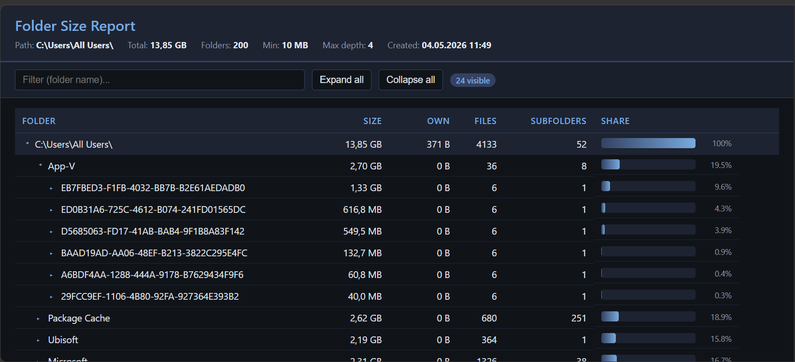

# PoSh Folder Size

A single-file PowerShell folder size analyzer that produces a self-contained, interactive HTML report.



## Features

- Recursive folder scan with size aggregation
- Collapsible tree (siblings sorted by size, largest first)
- Per-column sorting (click a column header)
- Live filter / search by folder name
- Top-N largest individual files
- Visual share bar per row (% of root)
- Configurable depth and minimum-size filter
- No external dependencies — pure PowerShell, output is a single HTML file

## Requirements

- Windows PowerShell 5.1 or PowerShell 7+
- For a complete scan of `C:\`, run as administrator

## Usage

```powershell
# Default: scan C:\, depth 4, min 10 MB, open report
.\get-FolderSize.ps1

# Scan a user profile, deeper tree, smaller threshold
.\get-FolderSize.ps1 -Path "$env:USERPROFILE" -MaxDepth 6 -MinSizeMB 10

# Scan C:\ but only show folders >= 100 MB
.\get-FolderSize.ps1 -Path "C:\" -MaxDepth 4 -MinSizeMB 100

# Custom output file, do not auto-open
.\get-FolderSize.ps1 -Output "C:\Temp\size.html" -NoOpen
```

## Parameters

| Parameter    | Type     | Default                          | Description |
|--------------|----------|----------------------------------|-------------|
| `-Path`      | string   | `C:\`                            | Root path for the analysis |
| `-MaxDepth`  | int      | `4`                              | Maximum recursion depth shown in the tree |
| `-MinSizeMB` | int      | `10`                             | Folders smaller than this are hidden (root is always shown) |
| `-TopFiles`  | int      | `50`                             | Number of largest individual files to list |
| `-Output`    | string   | `%TEMP%\FolderSize_Report.html`  | Output HTML file path |
| `-NoOpen`    | switch   | off                              | Do not auto-open the report |

## Notes

- Folders the user cannot access (permission denied) are silently skipped.
- The pre-scan to size siblings can take a while on large trees — progress is printed every 50 folders.
- The HTML report is fully self-contained (CSS + JS inline) and can be archived or sent as-is.
